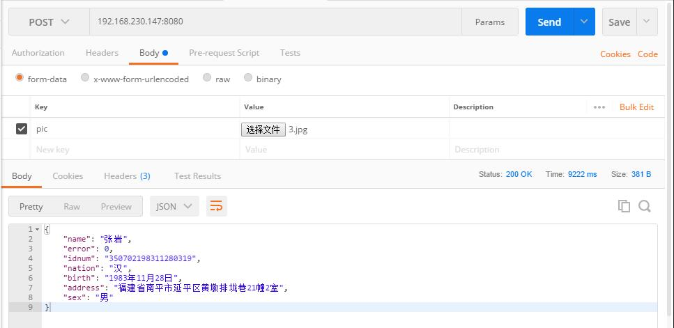

# 第二代身份证信息识别
可识别身份证上所有信息：姓名，性别，民族，出生日期，住址，身份证号码。提供Docker镜像部署方式
* 2018/8/21 更新，应该较大提升了准确率
* 2018/11/8 更新，优化算法，更新至tesseract4.0, 单张图片识别时间降低到*3s*以下
# 依赖：
> 本项目在Ubuntu 18.10基于tesseract 4.0 rc3，OpenCV2; 使用Python3.6进行开发 
> apt依赖安装： 
>`sudo apt install python3 python3-pip tesseract-ocr tesseract-ocr-chi-sim tzdata libsm6 libxext6 python3-tk -y`   
> Python依赖安装： 
>`sudo pip3 install -r idcardocr/requirements.txt`  
> ~~tessdata配置：~~ 
> ~~`sudo cp tessdata/* /usr/share/tesseract-ocr/tessdata`~~ 
# 使用方法：
> 识别本地图片 
> `import idcard_recognize;print idcard_recognize.process('testimages/3.jpg')`  
> http_server远程接收图片 
> `python3 idcard_recognize.py`   
> 默认监听端口为8080   
> Docker运行http_server:   
> `docker pull raymondwong/idcardocr;docker run -d -p 8080:8080 raymondwong/idcardocr`   
>> 测试:   
>>> 使用curl向服务器发送图片:   
>>>`curl --request POST \
  --url http://127.0.0.1:8080 \
  --header 'content-type: multipart/form-data; boundary=----WebKitFormBoundary7MA4YWxkTrZu0gW' \
  --form 'pic=@./testimages/3.jpg'`    
>>> 使用Postman：   
>>>   

# 性能 
> 平台： I5 8259u + 16g macOS 13.14 关闭OpenCL 
处理单张图片时间在2.5秒左右（单张图片只能使用单核心）   
~~处理4张图片时间也是4秒左右（4核心）~~   
关于OPENCL: 开启并不会使单张图片处理速度加快，但是能让你在同时间处理更多图片（譬如I5 6500每秒能处理4张图片，开启OPENCL后每秒能处理6张图片）   
开启OPENCL： 默认关闭，可以自行修改`idcard_recognize.http_server`中的`cv2.ocl.setUseOpenCL(False)`开启
